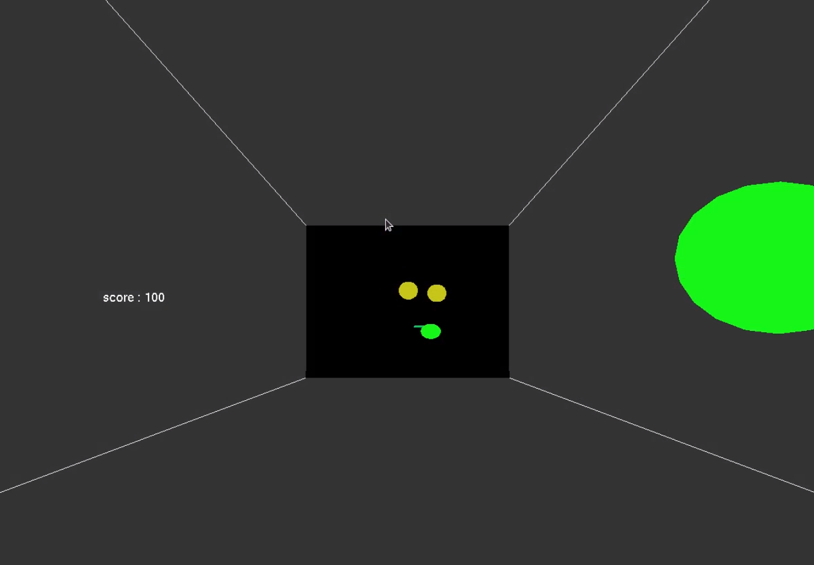

# pachpachi-pakupaku-game

画面奥の顔に向かってアイテムが降ってくるので、それを集めるゲームです。黄色いアイテムに目の位置を合わせて瞬き（「ぱちぱち」）、緑のアイテムに口の位置を合わせて開閉（「ぱくぱく」）させるとゲットできます。操作はカメラで認識した顔自体で行います。

## 要求ライブラリ
- OpenCV
- OpenGL
- dlib
- LAPACK
Ubuntu20.04 + OpenCV 4.2.0 + OpenGL 4.6 + LAPACK 3.9.0 で正常な動作を確認しています。
